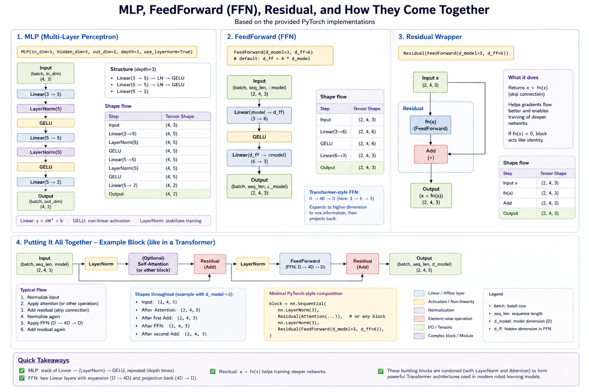

# Homework 1: PyTorch Tutorial Cheat Sheet

This README is a compact reminder of the important ideas from `ex1.ipynb` to `ex3.ipynb`.

## Setup

```bash
uv venv --python 3.12
uv pip install torch torchvision jupyter
```

All notebooks are in `src/`. Do not change function names or signatures because the autograder imports them directly.

## Exercise 1: Tensor Basics

### Shapes and Broadcasting

- Tensor shapes usually follow named conventions such as `B` batch size, `T` sequence length, `D` feature dimension, `H` attention heads, and `Dh` per-head dimension.
- Broadcasting aligns dimensions from the right. A dimension can broadcast if sizes match or one side is `1`.
- `keepdim=True` keeps reduced dimensions as size `1`, which makes later broadcasting easier.

```python
x.mean(dim=1, keepdim=True)  # (B, 1, D), can broadcast back to (B, T, D)
```

### Vectorization

- Prefer tensor ops over Python loops: `torch.cat`, `torch.stack`, `torch.where`, `scatter_add`, `one_hot`, and reductions.
- `repeat` copies data. `expand` creates a broadcasted view and only works when expanding size-1 dimensions.
- Masks are usually boolean tensors. Decide and remember the convention: sometimes `True` means keep, sometimes `True` means invalid.

### Attention Shapes

- Attention scores often have shape `(B, H, T, T)`.
- Value vectors often have shape `(B, H, T, Dh)`.
- Causal masks stop tokens from attending to future tokens.

```python
scores = torch.einsum("bhid,bhjd->bhij", q, k)
out = torch.einsum("bhij,bhjd->bhid", weights, v)
```

## Exercise 2: PyTorch Core

### Autograd

- `.backward()` computes gradients and stores them in leaf tensors' `.grad`.
- `torch.autograd.grad(...)` returns gradients directly and does not automatically fill `.grad`.
- Gradients accumulate, so reset them between training steps.

```python
optimizer.zero_grad()
loss.backward()
optimizer.step()
```

- Use `detach().clone().requires_grad_(True)` when you want a fresh local tensor for gradient computation.
- Use `torch.no_grad()` for setup or parameter updates that should not be tracked by autograd.

### Dataloading

- A `Dataset` needs `__len__` and `__getitem__`.
- A `DataLoader` handles batching, shuffling, and optional custom collation.
- For variable-length sequences, pad to `T_max` and keep a `padding_mask`.

### Optimizers

- Optimizers update parameters using gradients stored in `param.grad`.
- AdamW keeps state per parameter:
  - `m`: moving average of gradients
  - `v`: moving average of squared gradients
  - `t`: step count
- In-place methods end with `_`, for example `mul_`, `add_`, `zero_`, and `uniform_`.
- Optimizer updates should happen inside `torch.no_grad()` because they mutate parameters but are not part of the forward computation.

### Training Step Pattern

```python
model.train()
optimizer.zero_grad()
pred = model(x)
loss = loss_fn(pred, y)
loss.backward()
optimizer.step()
```

## Exercise 3: Neural Networks

### `nn.Module`

- Neural network layers are objects/classes that inherit from `nn.Module`.
- Calling a module like `layer(x)` automatically calls `layer.forward(x)`.
- Store trainable tensors as `nn.Parameter` so PyTorch registers them as model parameters.

### Linear Layer

`Linear(in_features, out_features)` computes:

```python
y = x @ W.T + b
```

- `weight` has shape `(out_features, in_features)`.
- Each output feature has its own weights over all input features.

### Embedding

- An embedding layer is a learnable lookup table.
- `weight` has shape `(num_embeddings, embedding_dim)`.
- Input token IDs select rows from this table.

```python
embedding(idx) == embedding.weight[idx]
```

### Dropout

- During training, dropout randomly zeroes activations with probability `p`.
- Kept values are scaled by `1 / (1 - p)` so the expected activation stays similar.
- During evaluation, dropout returns the input unchanged.

### Normalization

- `LayerNorm` normalizes over the last dimension using mean and variance, then applies learnable `weight` and `bias`.
- `RMSNorm` normalizes by root mean square only and usually has a learnable scale.

### MLPs, FFNs, and Residuals

- `nn.Sequential` runs modules one after another.
- An MLP is a stack of linear layers plus activations like `GELU`.
- A transformer-style FFN usually maps `D -> 4D -> D`.
- A residual wrapper returns `x + fn(x)`, which helps train deeper networks.



### Classification

- `nn.Flatten()` turns MNIST images from `(1, 28, 28)` into `784` features.
- A classification head maps features to logits, one raw score per class.
- Logits are not probabilities. Use cross entropy during training and `argmax` for prediction.

```python
pred = logits.argmax(dim=-1)
```

