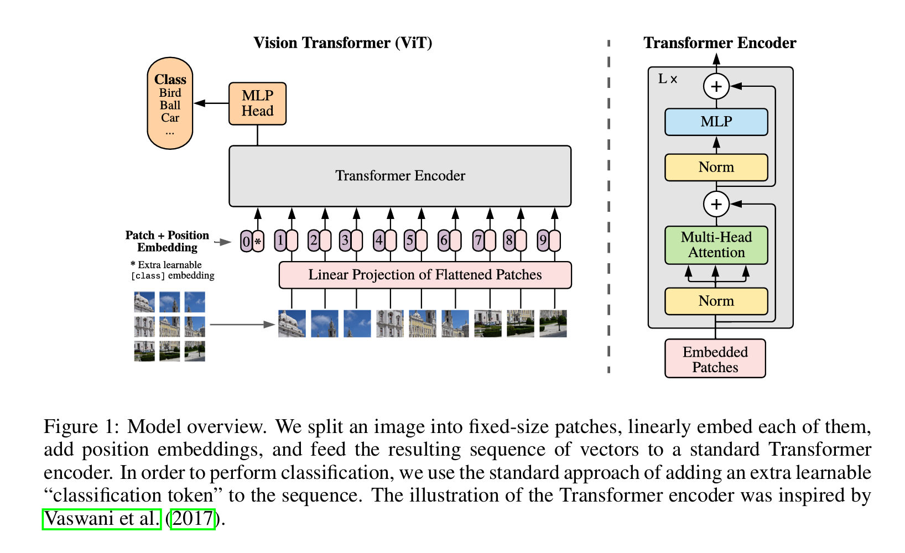

<div align="center">

# Exercise 4: Tiny Vision Transformer on MNIST

<span style="color:#7c3aed"><b>ViT Patch Tokens</b></span> ·
<span style="color:#2563eb"><b>Multi-Head Self-Attention</b></span> ·
<span style="color:#db2777"><b>GEGLU / SwiGLU Ablation</b></span>



<sub>Place `transformer.png` in this same folder so the diagram renders above.</sub>

</div>

---

## What This Notebook Builds

This exercise implements a small Vision Transformer-style classifier for MNIST. Instead of flattening the whole image directly, the model splits each image into small square patches, turns every patch into a token vector, adds position information, passes the token sequence through Transformer encoder blocks, and classifies the image using the learned class token.

The main experiment compares a standard Transformer feed-forward network against two GLU-style MLPs:

<div>
  <p><span style="color:#16a34a"><b>baseline</b></span>: normal GELU feed-forward network</p>
  <p><span style="color:#9333ea"><b>geglu</b></span>: GLU with GELU activation</p>
  <p><span style="color:#ea580c"><b>swiglu</b></span>: GLU with SiLU / Swish activation</p>
</div>

---

## The Full Data Flow

```text
MNIST image
  (B, 1, 28, 28)
      |
      v
patchify
  (B, 49, 16)
      |
      v
PatchEmbed: Linear(16 -> d_model)
  (B, 49, 64)
      |
      v
prepend class token + add positional embeddings
  (B, 50, 64)
      |
      v
Transformer encoder blocks
  (B, 50, 64)
      |
      v
take class token x[:, 0]
  (B, 64)
      |
      v
classification head Linear(64 -> 10)
  (B, 10)
```

Here `B` is batch size. MNIST has one channel, so a `4 x 4` patch has `1 * 4 * 4 = 16` raw values. With `patch_size = 4`, the `28 x 28` image becomes a `7 x 7` patch grid, giving `49` patch tokens.

---

## Key Tensor Ideas

### Patchifying The Image

`patchify` converts images from:

```python
(batch_size, channels, height, width)
```

to:

```python
(batch_size, num_patches, channels * patch_size * patch_size)
```

The important lines are:

```python
x = x.reshape(batch_size, channels, patches_h, patch_size, patches_w, patch_size)
x = x.permute(0, 2, 4, 1, 3, 5).contiguous()
```

The first line exposes the patch grid and the pixels inside each patch. The second line rearranges dimensions so each token corresponds to one real square patch, not just a row-wise chunk of the image. `contiguous()` makes the memory layout compatible with the final reshape.

### Patch Embedding

```python
self.proj = nn.Linear(patch_dim, d_model)
```

This is the learned patch projection. For MNIST with `patch_size = 4`:

```python
patch_dim = 1 * 4 * 4 = 16
```

If `d_model = 64`, every patch is converted from `16` raw pixel values into a `64`-dimensional token vector.

<p style="color:#2563eb"><b>Important:</b> `d_model` is not a tensor. It is an integer hyperparameter that says how wide each token vector is.</p>

### Class Token And Positional Embeddings

The Transformer does not naturally know where a patch came from. So the notebook adds learned position vectors:

```python
self.cls_token = nn.Parameter(torch.zeros(1, 1, d_model))
self.pos_embed = nn.Parameter(torch.zeros(1, num_tokens + 1, d_model))
```

The class token is expanded to the batch:

```python
cls_tokens = self.cls_token.expand(batch_size, -1, -1)
```

The `-1` means “keep this dimension the same.” The shape changes from `(1, 1, d_model)` to `(batch_size, 1, d_model)` without copying the data.

Then it is concatenated in front of the patch tokens:

```python
x = torch.cat([cls_tokens, x], dim=1)
```

`torch.cat` means concatenate, or join tensors together. Since `dim=1` is the token dimension, this turns:

```python
(B, 49, d_model)
```

into:

```python
(B, 50, d_model)
```

Finally, positional embeddings are added:

```python
return x + self.pos_embed[:, : x.shape[1], :]
```

This adds one learned position vector to every token, including the class token.

---

## Transformer Encoder Block

The block uses the pre-LayerNorm Transformer pattern:

```text
x = x + Dropout(SelfAttention(LayerNorm(x)))
x = x + MLP(LayerNorm(x))
```

`LN` means `LayerNorm`. It normalizes each token across its feature dimension, which keeps Transformer training more stable.

The attention line is:

```python
attn_out, _ = self.attn(attn_input, attn_input, attn_input, need_weights=False)
```

`nn.MultiheadAttention` expects:

```text
query, key, value
```

Because this is self-attention, all three come from the same token sequence. Each patch token can compare itself with every other patch token, then mix information from the useful ones.

`n_heads` controls how many attention heads run in parallel. With:

```python
d_model = 64
n_heads = 4
```

each head works on `64 / 4 = 16` features.

---

## MLP Variants

### Baseline FFN

The standard Transformer feed-forward block is:

```text
Linear(d_model -> d_ff)
GELU
Dropout
Linear(d_ff -> d_model)
Dropout
```

With `d_model = 64` and `d_ff = 256`, the MLP temporarily expands each token from 64 features to 256 features, then projects it back to 64 so it can be added to the residual stream.

### GLU Feed-Forward

The GLU version does:

```text
proj_in -> split -> activation(a) * gate -> dropout -> proj_out -> dropout
```

This line creates two halves:

```python
a, gate = self.proj_in(x).chunk(2, dim=-1)
```

`chunk(2, dim=-1)` splits the last dimension into two equal parts. One part goes through an activation function, and the other part acts as the gate.

The implemented activations are:

<div>
  <p><span style="color:#9333ea"><b>GEGLU</b></span>: `F.gelu(a)`</p>
  <p><span style="color:#ea580c"><b>SwiGLU</b></span>: `F.silu(a)`</p>
  <p><span style="color:#16a34a"><b>ReGLU</b></span>: `F.relu(a)`</p>
  <p><span style="color:#dc2626"><b>GLU</b></span>: `torch.sigmoid(a)`</p>
</div>

Then the gate is applied:

```python
x = a * gate
```

Dropout is a random mask over activations. It does not change the tensor shape; it only zeros some values during training. The first dropout masks hidden GLU features, while the second masks the final MLP output before it is added back through the Transformer residual path.

### Why `2 * d_ff / 3`?

The notebook uses:

```python
d_ff_gated = int(2 * d_ff / 3)
```

This follows the GLU paper’s parameter-count idea. A GLU block needs two input projections, one for `a` and one for `gate`, so using the full `d_ff` would make it larger than the baseline. The `2/3` rule keeps the comparison roughly fair.

---

## Classification Head

After all Transformer blocks:

```python
cls_token = self.norm(x[:, 0])
logits = self.head(cls_token)
```

`x[:, 0]` means:

```text
all batches, token index 0, all features
```

Token index `0` is the class token. The final head:

```python
nn.Linear(d_model, 10)
```

outputs 10 logits because MNIST has 10 digit classes: `0` through `9`.

Training uses:

```python
F.cross_entropy(logits, yb)
```

Cross entropy is the standard loss for multi-class classification. It expects raw logits, not probabilities, and internally applies a stable softmax plus negative log-likelihood.

---

## Experiment Setup

```python
patch_size = 4
d_model = 64
n_heads = 4
n_layers = 2
d_ff = 256
dropout = 0.1
runs = ["baseline", "geglu", "swiglu"]
```

The training loop uses AdamW and records:

<div>
  <p><span style="color:#2563eb"><b>train_losses</b></span>: every batch loss</p>
  <p><span style="color:#9333ea"><b>epoch_train_losses</b></span>: average training loss per epoch</p>
  <p><span style="color:#16a34a"><b>test_accs</b></span>: test accuracy per epoch</p>
  <p><span style="color:#ea580c"><b>num_params</b></span>: number of trainable model parameters</p>
</div>

Parameter count is computed with:

```python
sum(p.numel() for p in model.parameters() if p.requires_grad)
```

`p.numel()` counts how many numbers are inside a parameter tensor, and `requires_grad` keeps only trainable parameters.

---

## Results From The Notebook Run

<div style="border:1px solid #d1d5db; border-radius:12px; padding:14px; margin-bottom:12px;">
  <h3 style="color:#16a34a; margin-top:0;">Baseline GELU FFN</h3>
  <p><b>Parameters:</b> 105,098</p>
  <p><b>Final / Best Test Accuracy:</b> 0.9462 / 0.9462</p>
  <p><b>Final Train Loss:</b> 0.2707</p>
</div>

<div style="border:1px solid #d1d5db; border-radius:12px; padding:14px; margin-bottom:12px;">
  <h3 style="color:#9333ea; margin-top:0;">GEGLU</h3>
  <p><b>Parameters:</b> 105,010</p>
  <p><b>Final / Best Test Accuracy:</b> 0.9545 / 0.9545</p>
  <p><b>Final Train Loss:</b> 0.2264</p>
</div>

<div style="border:1px solid #d1d5db; border-radius:12px; padding:14px;">
  <h3 style="color:#ea580c; margin-top:0;">SwiGLU</h3>
  <p><b>Parameters:</b> 105,010</p>
  <p><b>Final / Best Test Accuracy:</b> 0.9574 / 0.9574</p>
  <p><b>Final Train Loss:</b> 0.2165</p>
</div>

---

## Short Conclusion

In this run, both GLU variants outperform the baseline while using almost the same number of trainable parameters. SwiGLU gives the best final test accuracy, followed by GEGLU, then the baseline GELU FFN.

<p style="color:#9333ea"><b>Main takeaway:</b> replacing the standard Transformer MLP with a gated MLP can improve convergence and final accuracy without meaningfully increasing parameter count.</p>

---

## Quick Glossary

<div>
  <p><span style="color:#2563eb"><b>patch_dim</b></span>: raw flattened patch size, e.g. `1 * 4 * 4 = 16` for MNIST.</p>
  <p><span style="color:#9333ea"><b>d_model</b></span>: width of each Transformer token vector, e.g. `64`.</p>
  <p><span style="color:#16a34a"><b>d_ff</b></span>: hidden width inside the MLP, e.g. `256`.</p>
  <p><span style="color:#ea580c"><b>n_heads</b></span>: number of parallel attention heads.</p>
  <p><span style="color:#dc2626"><b>class token</b></span>: learned token at position `0` used as the final image summary.</p>
  <p><span style="color:#0891b2"><b>logits</b></span>: raw class scores before softmax.</p>
</div>
